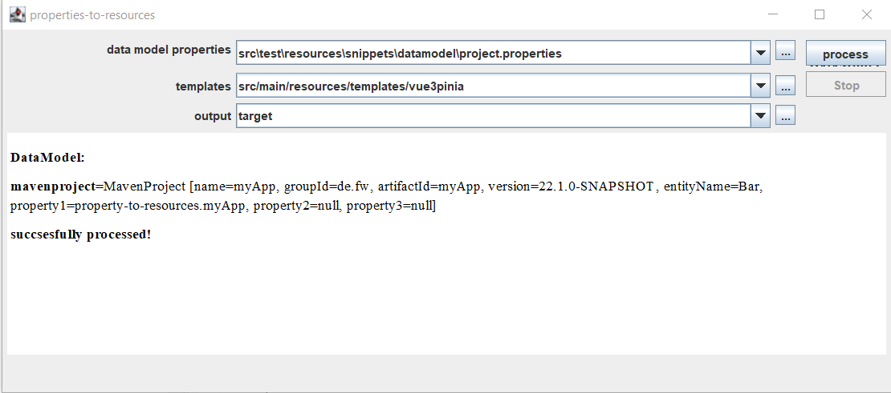
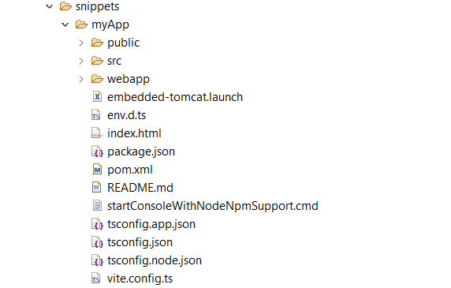

# properties-to-resources
	util reading properties(key/value) with apache configuration(v2) parsing to POJO(s) and generating structured output based on freemarker processor
	
	deployment.name=x
	deployment.namespace=y
	deployment.stage=z
	
	will parsed to Pojo: Deployment[name=x,namespace=y,stage=z]
	
	Or:
	route.one.path=x
	route.two.path=y
	route.three.path=z
	
	will parsed to Pojo-List: 
	routes=[Route [path=x], Route [path=y], Route [path=z]]
	

	Own Pojos can be implemented and used too.

# CLI-Usage
	call %JAVA_HOME%/bin/java -jar properties-to-resources-cli.jar -i datamodel/project.properties -t snippets_maven_openshift -o output

# SwingDemo

# Example-Output

